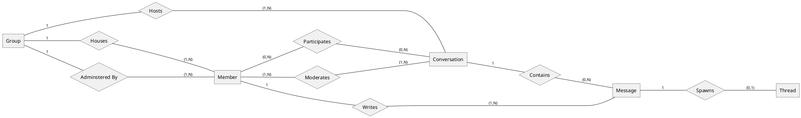
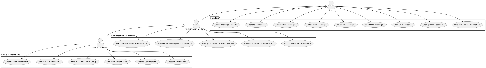

# Kolob - Simple, Secure Collaboration

Kolob is a simple collaboration tool designed to target an audience that may not
have email addresses or mobile phones but does have access to the internet. Once
a verified user has created a group, other users can use the group information
to sign in to Kolob and start posting messages to the group.

## Motivation

The youth organization of The Church of Jesus Christ of Latter-day Saints gives
young men and women under the age of 18 opportunities to develop themselves as
leaders. While there are adult leaders that assist the youth, one of the goals
of this organization is for it to be "youth led". This means that the youth are
supposed to be in charge of as many aspects of the organization as possible.

In order for youth to truly lead efforts such as activity planning, service
project organization, and peer ministering, they need a reliable way of
communicating with each other. Traditionally, this communication has taken place
using text messages and email; however, not all youth have cell phones and email
address. This means that for some youth communication has to be relayed through
their parents. While parents should always be involved in communication between
their youth, acting as proxy does not always allow the youth to be truly
self-organized.

Kolob attempts to fill this gap by providing a means for youth to collaborate
with each other and their adult leaders even if they do not have a cell phone or
an email account. As long as they have access to the internet, they can use
credentials given them by their youth leaders to collaborate online with their
peers.

## Features

The primary objectives or Kolob are:

- **Accountless**: no phone number or email address required

- **Simple**: just text-based communication with no extra bells and whistles

- **Secure**: every piece of information is encrypted with the highest standards
  in transit and at rest

## Non-Features

The following elements are intentionally not a part of Kolob:

- **Direct Messaging**: members cannot message each other individually. They can
  only communicate in conversations visible to more than one member.

## Command Interface

The `kolob` executable is used to launch a single Kolob server.

The `kolobctl` executable is used to manage several kolob servers. It provides a
clean user interfaces that lets users create new groups and monitors the Kolob
server associated with a group. `kolobctl` uses containerization technologies to
do most of the heavy lifting, so you should make sure Docker or Podman is
installed if you are going to be using it.

## Data Model

Kolob focuses on a minimal feature set in order to provide the highest quality
experience for a special niche of users. The diagram below provides an overview
of the various data entities in Kolob and how they relate to each other. The
remainder of this section breaks down this data model and explains the
motivation behind the different elements.

    

### Group

The central element in this data model is the **Group**. A group is where users
can join together and post messages about various topics. Every group has at
least one Adminstrator. Additional details about the Group Administrator are
provided in the "Member" sections.

A single Kolob server can only run one group. This enables complete isolation of
group data and also make the project easier to maintain. As such, the idea of a
group is more conceptual than it is concrete in the program's implementation.

### Conversation

A **Conversation** is a time-ordered list of messages sent by group members
surrounding a particular topic. A single group may contain more than one
conversation. When a group is first created it contains a single conversation
titled "General" that serves as a starting point for the group. The Group
Creator is free to remove this conversation after the group is created so long
as there is at least one additional conversation in the group.

### Member

A **Member** belongs to one and only one group. Member's are identified within a
group by their username. A username is unique within a group, but Kolob does not
require that usernames be unique across groups.

#### Group Moderator

The member that creates the group is called the **Group Moderator**. While other
group members do not need to provide a separate email or phone number, the Group
Moderator _must_ provide contact information and respond to a confirmation
before the group is created.

Only the Group Moderator can create profiles for Members to join a group.

This security feature protects the Kolob server from being overwhelemed with
fake groups and helps provide group members with a sense of security because
they must know the Group Administrator personally in order to join a group, as
group information must be given to them by a Group Administator.

### Message

Members write Messages to communicate with each other. A single Message can
belong to only one Conversation, although Message links can be used between
Conversations to direct Members to previously posted content. Messages can be
edited and removed by the Member who originally wrote the Message.

### Thread

Sometimes Members may want to respond to a specific Message in a Conversation.
To do so, a Member can create a Thread on a Message where additional Messages
can be posted that relate to the original Message directly.

## Data Storage

Kolob can be extended to support multiple backend data storage technologies. The
default backend is driven by SQLite.

Data is always written to disk before it is applied to the in-memory store. Data
on disk is always encrypted.

## Access Controls

The following diagram lists the use cases available to users of different roles:

    

Kolob uses a simple role-based access control (RBAC) model to authorize actions
that follows the organization of use cases in the above diagram.

## Security

All member, conversation, and message information within a group is encrypted
using AES with a 256-bit key generated by a cryptographically strong random
number generator when the group is created. This key is itself encrypted using a
key derived by the PBKDF2 algorithm from a group password set by the Group
Moderator. This PBKDF2 algorithms uses the password, a 32 byte salt, and
1,000,000 iterations to generate the key used to encrypt group data.

The user provided password must be between 16 and 72 characters and contain at
least one lowercase letter, one uppercase leter, one number, and one special
character.

The encrypted key is stored in the group database and extracted whenever a user
makes a request for encrypted data. Only authenticated group members are able to
make these requests.

The hashed group password and hashed member passwords are also stored in the
database to support authentication; however, it is important to note that the
password itself is used to generated the key that encrypts the group key, not
the hash of the password used for authentication. The member username and hash
used for authentication is stored in an encrypted format inside the database.
This guarantees that users still can't be identified even by their usernames if
the database is compromised.

> NOTE: The iteration count was selected based on the [OWASP suggestion] of
> 600,000 or more as referenced in a document of [comments on SP 800-132]
> provided to the NIST. The password criteria was selected based on the
> [password guidelines] provided by OWASP.

## Interfaces

### Events Over Websocket

Submitting an HTTP GET request to the `api/v1/stream` resource will establish a
secure websocket connection with the Kolob server. This connection can be used
to send events to the server.

Typically these events contain request messages for actions to be performed by
the server. The server can also send events to the client; however, events are
not necessarily a direct response to a client-sent eventm. Instead, the Kolob
client handles events agnostic of whether that event was initiated by an event
it sent previously.

TODO: list events

### REST Over HTTP

The following table provides a summary of the available HTTP resources and the
methods on those resources you can use to interact with the Kolob server.

| Path                                  | Method | Action                                   |
| :------------------------------------ | :----- | :--------------------------------------- |
| `/api/v1/auth`                        | POST   | Authenticate a member of a group         |
| `/api/v1/group`                       | POST   | Initialize the group                     |
| `/api/v1/group`                       | GET    | Fetch group information                  |
| `/api/v1/group`                       | PUT    | Update group information                 |
| `/api/v1/group/auth`                  | PUT    | Update group credentials                 |
| `/api/v1/members`                     | POST   | Add a member to the group                |
| `/api/v1/members`                     | GET    | List all group members                   |
| `/api/v1/members/{id}`                | GET    | Fetch member information                 |
| `/api/v1/members/{id}`                | PUT    | Update member information                |
| `/api/v1/members/{id}`                | DELETE | Remove a member from the group           |
| `/api/v1/members/{id}/auth`           | PUT    | Update member credentials                |
| `/api/v1/conversations`               | POST   | Create a new conversation                |
| `/api/v1/conversations/{id}`          | GET    | Fetch conversation information           |
| `/api/v1/conversations/{id}`          | PUT    | Update conversation information          |
| `/api/v1/conversations/{id}/messages` | GET    | List all messages in a conversation      |
| `/api/v1/conversations/{id}/members`  | GET    | List all messages in a conversation      |
| `/api/v1/messages`                    | POST   | Add a mesage to a conversation or thread |
| `/api/v1/messages/{id}`               | GET    | Fetch a single messagee                  |
| `/api/v1/messages/{id}`               | PUT    | Update a message                         |
| `/api/v1/messages/{id}`               | DELETE | Delete a message                         |
| `/api/v1/threads`                     | POST   | Create a thread for a message            |
| `/api/v1/threads/{id}`                | GET    | List messages in a thread                |

## Design

TODO

<!-- LINKS -->
<!-- prettier-ignore-start -->
[OWASP suggestion]: https://cheatsheetseries.owasp.org/cheatsheets/Password_Storage_Cheat_Sheet.html
[Comments on SP 800-132]: https://csrc.nist.gov/csrc/media/Projects/crypto-publication-review-project/documents/initial-comments/sp800-132-initial-public-comments-2023.pdf
[password guidelines]: https://cheatsheetseries.owasp.org/cheatsheets/Authentication_Cheat_Sheet.html
<!-- prettier-ignore-end -->
